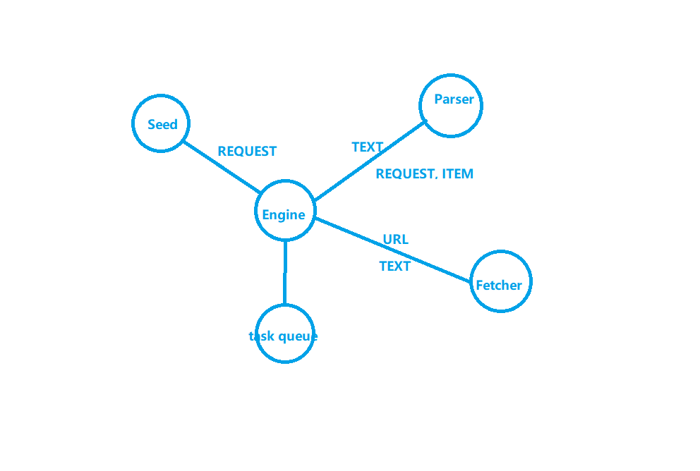

# Go爬虫(ZCOOL站酷)
`站酷(ZCOOL),中国设计师互动平台。深耕设计领域十五年,站酷聚集了1300万设计师、摄影师、插画师、艺术家、创意人,设计创意群体中具有较高的影响力与号召力。本仓库是用Go语言爬取站酷上的插画作品集(本人喜欢插画，很喜欢站酷上的作品，代码仅供学习交流！)`
## 编程环境
- Go(go1.17.7 windows/amd64)
- GoLand(2021.2.2) 
- Google Chrome
- Windows 11
## 单任务版爬虫

- 站酷分类解析器
- 站酷列表解析器
- 站酷帖子解析器
```go
// 解析器Parser
// 输入：utf-8编码的文本
// 输出：Request{URL, 对应Parser}列表，Item列表
```
## 并发版爬虫

## 分布式爬虫
