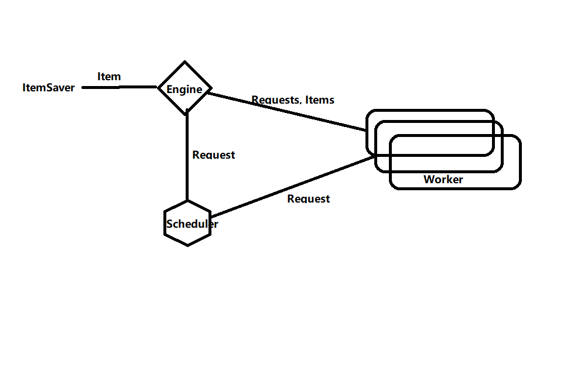

# Go爬虫(SPA web)
`站酷(ZCOOL),中国设计师互动平台。深耕设计领域十五年,站酷聚集了1300万设计师、摄影师、插画师、艺术家、创意人,设计创意群体中具有较高的影响力与号召力。本仓库是用Go语言爬取站酷上的插画作品集(本人喜欢插画，很喜欢站酷上的作品，代码仅供学习交流！)`
## 编程环境
- go version go1.18.3 linux/amd64
- GoLand(2021.2.2) 
- Google Chrome
- Windows 11
- Ubuntu 22.x
- [Docker](https://cr.console.aliyun.com/cn-hangzhou/instances/mirrors)
- [ElasticSearch 7.x](https://www.elastic.co/guide/en/elasticsearch/reference/7.17/docker.html)  
    `Base Instructions:(copy!copy!copy!)`
  - `docker pull docker.elastic.co/elasticsearch/elasticsearch:7.17.5`
  - `docker run -p 127.0.0.1:9200:9200 -p 127.0.0.1:9300:9300 -v /home/yinlei/Desktop/goCrawlerData:/usr/share/elasticsearch/data -e "discovery.type=single-node" docker.elastic.co/elasticsearch/elasticsearch:7.17.5`

`you must add:`
- [Chromedp](https://github.com/chromedp/examples)
- [GoQuery](https://github.com/PuerkitoBio/goquery#api)
- [ElasticClient 7](https://github.com/olivere/elastic)

## Usage

You can clone this project, and replace some category's url which is written at `main.go`.
Of course, you only need some logical code to achieve your target. for example, `zcool` folder which you can refer.

I also add some intersting website in future. `Douyin` is a good target.


## 单任务版爬虫

- 站酷分类解析器
- 站酷列表解析器
- 站酷帖子解析器
```go
// 解析器ParserGo(go1.17.7 windows/amd64)
// 输入：utf-8编码的文本
// 输出：Request{URL, 对应Parser}列表，Item列表
```
## 并发版爬虫

单任务版的瓶颈在于每次fetcher并解析后才轮到下一个解析，这里通过Goroutine实现并发版本。

Scheduler实现思路：  
- 思路1：所有Worker公用一个输入(Request送入Worker让他们自己去抢，谁抢到谁做)
- 思路2：并发分发Request(Scheduler为每个Request创建goroutine)
- 思路3[最终改进版]：Request队列、Worker队列(scheduler engine worker都互相通过Channel通信)
- 
## 分布式爬虫
